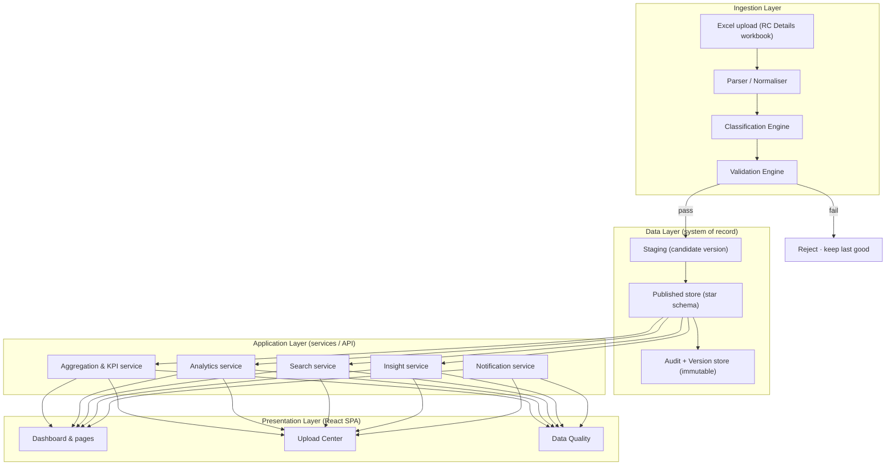

# 02 · System Architecture

> **Principle:** loosely coupled modules over a validated database, with Excel as an ingestion channel only. No screen ever reads a spreadsheet at runtime.

---

## 1. Architectural goals

The architecture is optimised, in order, for **integrity, maintainability, scalability, performance and extensibility**. Concretely:

- A **single validated system of record** (the database) that every view is served from — never the source Excel.
- **Separation of concerns** so that ingestion, validation, analytics and presentation evolve independently.
- **A validation gate** that no data can bypass on its way to being published.
- **Immutable history** so any past state can be reproduced, audited and rolled back to.
- **Headroom** to add data sources (PFMS, SharePoint, ministry APIs) later without redesign.

## 2. Layered view



The golden rule reads top-to-bottom: **data only reaches the Published store through the Validation Engine**, and the Presentation layer only ever talks to the Application layer over the Published store.

## 3. Module catalogue

Each module is independently ownable, testable and replaceable. Coupling is through typed contracts (the data model in `03`, the API in §7), not shared internals.

| Module | Responsibility | Key spec |
|---|---|---|
| **Ingestion / Upload Engine** | Accept an Excel file, parse the 13 RC tabs + masters, normalise headers, stage a candidate version | `07` |
| **Classification Engine** | Assign each transaction a sub-category from the controlled vocabulary (explicit wording first, scheme-context fallback), log anything ambiguous | `03 §7`, `07 §4` |
| **Validation Engine** | Run the full rule catalogue (schema → business → referential → reconciliation → classification → quality); decide publish/reject | `06` |
| **Dashboard Engine** | Compose pages, KPIs, filters, drill state, breadcrumbs | `04` |
| **Analytics Engine** | Pareto, treemap, heat map, waterfall, sunburst, variance, ranking, decomposition | `05 §4` |
| **Insight Engine** | Generate executive insight cards, health score, top risks, recommendations | `05 §2` |
| **Search Engine** | Universal search across RC, grantee, transaction, sub-category, subvertical, head | `05 §5` |
| **Exception Engine** | Detect idle balance, low utilisation, outliers, duplicates, missing info, large releases | `05 §6` |
| **Notification Engine** | Raise alerts (new exceptions, failed validation, publish success) to the right roles | `05 §7` |
| **Audit Engine** | Record every upload, publish, rollback and access as an immutable event | `07 §7` |
| **Auth & RBAC** | Authenticate users; enforce the role matrix | `07 §8` |
| **Settings** | Thresholds, taxonomy governance, formatting, user/role management | `04 §Settings` |

**Coupling rule:** a module may depend on the data-model contract and on other modules' published APIs, never on their internal tables or code. The Analytics Engine, for instance, reads the Published star schema — it does not know how ingestion produced it.

## 4. Recommended technology stack

Aligned to the sponsor's own recommendation, chosen for long-term government ownership and maintainability.

| Concern | Choice | Rationale |
|---|---|---|
| Frontend framework | **React + TypeScript** | Type-safe, mainstream, hireable; component model fits a modular UI |
| Styling | **Tailwind CSS** | Token-driven, matches the design system in `09` with zero drift |
| Component primitives | **shadcn/ui** (Radix under the hood) | Accessible, unopinionated, own-the-code (no vendor lock) |
| Data viz | **Recharts** or **visx/D3** | SVG, themeable to the `09` palette; D3 for bespoke marks (waterfall, sunburst) |
| Client data/query | **TanStack Query** | Caching, background refresh, request dedupe out of the box |
| Backend / DB | **Supabase (PostgreSQL)** | Managed Postgres + Auth + Row-Level Security + storage + edge functions |
| Ingestion parsing | **SheetJS (xlsx)** in an edge/server function | Robust multi-sheet Excel parsing off the main thread |
| Auth & RBAC | **Supabase Auth + Postgres RLS** | Role enforcement at the data layer, not just the UI |
| File storage | **Supabase Storage** | Holds uploaded workbooks as immutable version artifacts |
| Hosting | **Vercel / Netlify (SPA)** + Supabase cloud (or on-prem Postgres for a ministry-hosted deployment) | Cloud for speed of delivery; portable to government infrastructure |

> **Portability note:** nothing above is locked to a vendor. Supabase is Postgres; the ingestion and validation logic is plain TypeScript. A ministry-hosted deployment can swap Supabase cloud for a self-managed Postgres + object store with no application rewrite — important for a GoI system that may need to run on NIC / MeitY infrastructure.

## 5. Data flow — upload to dashboard

```mermaid
sequenceDiagram
  actor FO as Finance Officer
  participant UP as Upload Engine
  participant CL as Classification
  participant VA as Validation
  participant DB as Published store
  participant CH as Checker (approver)
  participant UI as Dashboard
  FO->>UP: Upload RC Details workbook
  UP->>UP: Parse 13 RC tabs + masters, normalise headers
  UP->>CL: Classify transactions (explicit → contextual)
  CL->>VA: Candidate version + classification basis
  VA->>VA: Run rule catalogue (06)
  alt All blockers pass
    VA->>CH: Present validation report + diff vs current
    CH->>DB: Approve → publish new version
    DB->>UI: Refresh views, regenerate insights
  else Any blocker fails
    VA-->>FO: Reject, itemised errors; last-good stays live
  end
```

This flow is the backbone of `07`. The two guarantees it encodes: **(a)** publishing requires both a passing validation and a human approval (maker-checker); **(b)** on failure, the previously published version continues to serve every screen unchanged.

## 6. Runtime data-serving model

- **Read path:** the SPA calls the Application layer, which serves pre-aggregated KPIs and paginated detail from the Published star schema. Heavy roll-ups (totals by centre/subvertical/sub-category, utilisation buckets) are **materialised** on publish, not computed per request.
- **Aggregation strategy:** compute-on-publish, read-on-demand. Because a publish is infrequent (weekly) and reads are frequent, the expensive work happens once per version. This is what makes the `< 2s` dashboard and `< 500ms` filter targets achievable on modest data.
- **Caching:** three tiers — (1) materialised aggregates in Postgres, (2) HTTP/query cache via TanStack Query keyed by `version_id + filter state`, (3) an in-memory client cache of the current version's dimension tables (13 RCs, taxonomy, subverticals) so filtering is local and instant.
- **Cache invalidation** is trivial and correct because every cache key includes the immutable `version_id`; a new publish produces new keys, so stale data is impossible by construction.

## 7. API design (contract sketch)

REST/RPC endpoints over the Published store; all reads are version-aware and role-scoped. Illustrative, not exhaustive:

| Endpoint | Returns |
|---|---|
| `GET /overview?version=current` | Headline KPIs, health score, top exceptions |
| `GET /breakdown?dim=regional_centre&measure=balance` | Aggregates for a dimension (drill level) |
| `GET /breakdown?dim=sub_category&parent=<rc_id>` | Next drill level, filtered to a parent |
| `GET /transactions?filters=…&page=…` | Paginated voucher-level detail |
| `GET /exceptions?type=idle_balance` | Exception list for a rule |
| `GET /search?q=<term>` | Cross-entity search hits |
| `POST /uploads` | Stage a candidate version from an uploaded workbook |
| `GET /uploads/{id}/validation` | Validation report for a candidate |
| `POST /uploads/{id}/publish` | Approve + publish (checker role only) |
| `POST /versions/{id}/rollback` | Roll back to a prior published version |
| `GET /audit?entity=…` | Immutable audit events |

Every response carries the `version_id` it was served from, so the UI can always show "data as of version N, published <date>".

## 8. Non-functional requirements

| ID | Requirement | Target |
|---|---|---|
| NFR-1 | Executive dashboard first paint | **< 2 s** |
| NFR-2 | Filter / cross-filter response | **< 500 ms** |
| NFR-3 | Universal search results | **near-instant (< 300 ms)** |
| NFR-4 | Upload parse + validate (single workbook) | **< 20 s** |
| NFR-5 | Publish → dashboard refreshed | **< 30 s** |
| NFR-6 | Availability | 99.5%+ during working hours; last-good always served |
| NFR-7 | Accessibility | WCAG 2.1 AA (see `09 §10`) |
| NFR-8 | Auditability | Every state-changing action recorded, immutably, with actor + timestamp |
| NFR-9 | Security | RBAC enforced at the data layer (RLS); secure file handling (`07 §8`) |
| NFR-10 | Maintainability | Modular, typed, documented, unit-testable (`10` DoD) |
| NFR-11 | Scalability | Correct and performant from 88 rows today to 10⁵+ transactions across multiple FYs |

## 9. Extensibility (designed for, not built in v1)

The architecture leaves clean seams for the future:

- **New ingestion sources.** The Parser/Normaliser produces a canonical transaction record (`03`). A PFMS/API connector or a SharePoint/OneDrive watcher becomes just *another producer* of that record — the validation, storage and presentation layers are untouched.
- **Multi-scheme / multi-ministry.** The star schema is scheme-agnostic; adding a scheme dimension lets the same platform serve beyond Khelo India.
- **Multi-year.** Versions are already time-stamped; a fiscal-year dimension enables year-over-year and trend analysis as data accrues.
- **Write-back / workflow.** Should the ministry later want in-app corrections or sanction workflows, the audit and versioning spine already supports it.

## 10. Environments

Three environments — **Development, Staging (UAT), Production** — with identical schema and validation rules. Staging is where a weekly workbook can be dry-run through upload→validate→publish before it touches Production. Configuration (thresholds, roles) is environment-scoped; the taxonomy is shared and version-controlled.

---

*Next: read `03_Data_Model.md`.*
