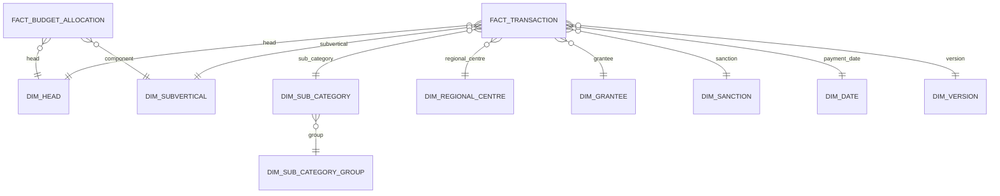

# 03 · Data Model

> **Law document.** Every KPI, filter, chart, drill-path and validation rule in this PRD refers to entities defined here. If a build decision conflicts with this file, this file wins.

---

## 1. The canonical hierarchy

All aggregation, drill-down and navigation follow one six-level financial hierarchy:

```
HEAD
  └─ SUBVERTICAL
       └─ SUB CATEGORY            (rolls up to SUB CATEGORY GROUP for analysis)
            └─ REGIONAL CENTRE
                 └─ GRANTEE
                      └─ TRANSACTION
```

The levels, with live baseline figures (`00 §4`):

| Level | Count | Members / examples |
|---|---|---|
| **Head** | 2 | Recurring (₹19.95 Cr), Non-Recurring (₹7.83 Cr) |
| **Subvertical** | 5 | Talent Identification & Development ₹11.63 Cr · Khelo India Centres ₹7.36 Cr · Support to Academies ₹6.55 Cr · Sports for Peace & Development ₹2.18 Cr · Khelo India Games ₹0.06 Cr |
| **Sub-category** | 14 in use / 40 defined | Athlete Training Support (NCOE) ₹9.82 Cr · Sports Equipment ₹6.37 Cr · Coach Salary (PCA) ₹2.89 Cr · … |
| **Regional Centre** | 13 | Kolkata ₹4.98 Cr · Imphal ₹3.21 Cr · Trivandrum ₹3.04 Cr · … · Chandigarh ₹0.52 Cr |
| **Grantee** | 13 named here | Mostly the RC itself (funds released for onward release); downstream grantees named in narration |
| **Transaction** | 88 | Voucher-level release with sanction no., date, narration, amounts |

> **Note on Grantee.** In the current dataset the recorded grantee is largely the Regional Centre, because releases are made *to* the RC for onward disbursement to academies, KICs, NCOEs and foundations. The data model keeps Grantee as its own dimension (not merged into RC) so that when true downstream grantees are recorded — e.g. *Pullela Gopichand Badminton Foundation*, *Sports Authority of Karnataka* — no schema change is needed. The **Sub-category group** is an analytical roll-up of sub-categories, not a hierarchy level, and is modelled as an attribute of the sub-category dimension.

## 2. Dimensional (star) model

The Published store is a star schema: one fact table of transactions, surrounded by conformed dimensions. This is what the Analytics and Dashboard engines read.



### 2.1 Grain
One row of `fact_transaction` = **one voucher-level fund release** on one RC tab (the master record). This is the atomic, non-divisible unit and the target of all drill-down.

## 3. Fact table — `fact_transaction`

Derived from the workbook's MASTER DATA sheet (its 21 columns), plus surrogate keys and derived measures.

| Column | Type | Source | Notes |
|---|---|---|---|
| `transaction_id` | PK (surrogate) | generated | Stable across versions where the record is unchanged |
| `version_id` | FK → dim_version | ingestion | Which published version this row belongs to |
| `s_no` | int | S.NO. | Serial within the master sheet |
| `source_sheet` | text | Source Sheet | Originating RC tab (e.g. `KOLKATA`) |
| `source_row` | int | Source Row | Row on that tab — the audit back-pointer |
| `payment_date` | date | Payment Date | 13–19 May 2026 in baseline |
| `voucher_no` | text | Voucher No. | e.g. `TSA/77` |
| `sanction_no` | text | Sanction No. | e.g. `KITD/12`; FK to dim_sanction |
| `head_id` | FK → dim_head | Head | Recurring / Non-Recurring |
| `subvertical_id` | FK → dim_subvertical | Subvertical | Scheme component |
| `regional_centre_id` | FK → dim_regional_centre | Regional Centre | Constant "Regional Centre" text in source; RC identity comes from grantee/tab |
| `grantee_id` | FK → dim_grantee | Name of Grantee | e.g. SAI RC Kolkata |
| `expenditure_type` | text | Type of Expenditure | All "Limit Assigned" today |
| `narration` | text | Detailed Narration | **Never altered** — corrections logged, not edited |
| `sub_category_id` | FK → dim_sub_category | SUB CATEGORY | From controlled vocabulary |
| `classification_basis` | enum | derived | `explicit` (84) or `contextual` (4) |
| `net_amount` | numeric(15,2) | NET AMOUNT | Sanctioned / released amount |
| `amt_general` | numeric(15,2) | General | Community split — general |
| `amt_sc` | numeric(15,2) | SC | Community split — Scheduled Caste |
| `amt_st` | numeric(15,2) | ST | Community split — Scheduled Tribe |
| `utilisation` | numeric(15,2) | Utilization by RC | Amount spent by RC |
| `balance_remaining` | numeric(15,2) | Balance Remaining with the RC | Net − Utilisation |
| `utilisation_pct` | numeric(7,4) | derived | `utilisation / net_amount` (0 when net = 0) |

### 3.1 Derived measures (computed on publish)
- `utilisation_pct = utilisation / net_amount` (guard: 0 when `net_amount = 0`).
- `balance_pct = balance_remaining / net_amount`.
- `is_idle = (utilisation = 0)` — 61 rows in baseline.
- `is_fully_utilised = (utilisation_pct = 1)` — 23 rows.
- `community_general_pct / sc_pct / st_pct` for equity analysis.

### 3.2 Model invariants (must hold on every row and in aggregate)
1. `net_amount = utilisation + balance_remaining` (per row and summed).
2. `amt_general + amt_sc + amt_st = net_amount` (community split reconciles).
3. `sub_category_id` ∈ the controlled vocabulary (no free-text categories).
4. Aggregate `Σ net_amount` = ₹27,77,81,215 for the baseline version and equals the three-way tie-out (`06`).
5. The `TOTAL` artifact row is **never** loaded as a transaction (ingestion rule `07 §3`).

## 4. Dimension tables

| Dimension | Key attributes | Members (baseline) |
|---|---|---|
| `dim_head` | name | Recurring, Non-Recurring |
| `dim_subvertical` | name, code | TID, KIC, Support to Academies, SPD, KIG |
| `dim_sub_category` | name, group_id, status (`In Use`/`Reserved`), definition, classification_rule | 40 terms (14 in use) |
| `dim_sub_category_group` | name | Athlete Development, Equipment & Consumables, Human Resources, Competition & Events, Governance & Capacity Building, Infrastructure, Administration, Others |
| `dim_regional_centre` | name, city, is_hq, region (incl. NER flag) | 13 (Kolkata…Chandigarh, DDO HQ) |
| `dim_grantee` | name, type (RC / academy / KIC / NCOE / foundation / state body) | 13 today; open-ended |
| `dim_sanction` | sanction_no, series (KITD, SLKIC, SA, SPD, ASC…) | derived from data |
| `dim_date` | date, week, month, fy | calendar |
| `dim_version` | version_id, uploaded_by, published_by, published_at, status, file_ref, checksum | one per publish |

### 4.1 Regional Centres (reference)

| RC | Net amount | Txns |
|---|---|---|
| SAI RC Kolkata | ₹4.98 Cr | 13 |
| SAI RC Imphal | ₹3.21 Cr | 7 |
| SAI RC Trivandrum | ₹3.04 Cr | 14 |
| SAI RC Sonepat | ₹2.78 Cr | 8 |
| SAI RC Guwahati | ₹2.33 Cr | 11 |
| DDO HQ | ₹2.22 Cr | 2 |
| SAI RC Gandhinagar | ₹2.08 Cr | 8 |
| SAI RC Bhopal | ₹1.78 Cr | 4 |
| SAI RC Bangalore | ₹1.65 Cr | 4 |
| SAI RC Mumbai | ₹1.44 Cr | 4 |
| SAI RC Patiala | ₹1.08 Cr | 1 |
| SAI RC Lucknow | ₹0.68 Cr | 5 |
| SAI RC Chandigarh | ₹0.52 Cr | 7 |

## 5. The budget / allocation layer — `fact_budget_allocation`

The second workbook (`Expenditure Tracker_29May2026.xlsx`, "Khelo India Scheme — Component Expenditure Tracker, Weekly") supplies the **top-down** side: Budget Estimate (BE) 2026–27 allocation, amount assigned to SAI, and balance, by scheme component and Recurring/Non-Recurring, with weekly columns.

| Column | Meaning |
|---|---|
| `component_id` | FK → dim_subvertical (scheme component) |
| `head_id` | Recurring / Non-Recurring |
| `be_allocation_cr` | Amount allocated under KI Scheme at BE 2026–27 |
| `assigned_to_sai_cr` | Amount assigned to SAI |
| `balance_cr` | Balance amount |
| `expenditure_to_date_cr` | Expenditure as on date |
| `week` | Reporting week (W2, W3, W4…) |

Holding both facts lets the platform answer *allocation vs release vs utilisation* — the full funnel from BE → assigned → released to RC → utilised. In v1 this powers budget-concentration and "burn vs plan" views (`05 §2`). If the second file's weekly grain is not yet reliable, load BE + assigned + balance only and defer the weekly series.

## 6. Source-to-target mapping

```
13 Regional-Centre tabs  ──parse──▶  normalised transaction rows
        (raw)                              │
                                           ├─ header harmonisation (Guwahati NER-* → General/SC/ST)
                                           ├─ drop TOTAL / blank artifact rows
                                           ├─ classify → sub_category + basis
                                           ▼
                                    MASTER DATA (canonical) ──load──▶ fact_transaction
SUB CATEGORY MASTER  ──load──▶ dim_sub_category (+ status, rule, definition)
Weekly Component Tracker ──load──▶ fact_budget_allocation
```

The workbook's own MASTER DATA sheet is the reference implementation of this mapping; the platform reproduces it in code so the transformation is testable and reproducible rather than manual.

## 7. Taxonomy governance (controlled vocabulary)

The sub-category vocabulary is a **governed asset**, not free text. It has 40 terms across 8 groups, each marked **In Use** (has FY data) or **Reserved** (pre-approved, held open for future spend so new category names are never coined ad hoc).

| Group | In use (baseline) | Reserved examples |
|---|---|---|
| Athlete Development | Accredited Academy Support, Athlete Training Support (NCOE), Athlete Travel Grant, Boarding Lodging & Travel, Talent Assessment Camps | Athlete Scholarship & Stipend, Coaching & Training Camps, Nutrition & Diet, Sports Science & Medical Services, Transportation & Logistics |
| Human Resources | Coach Salary (PCA), Manpower Remuneration (KISCE), Programme Workforce Salary | Contractual & Outsourced Staff |
| Equipment & Consumables | Sports Equipment, Sports Science Equipment, Sports Consumables Grant | Uniform & Sports Kit |
| Competition & Events | Marathons & Mass Participation Events, Sports Events & Tournaments | Anti-Doping, Event Operations & Management, Hospitality, Technical Officials & Referees, Volunteer Support |
| Governance & Capacity Building | Capacity Building Programme | Monitoring & Evaluation, Research & Development |
| Infrastructure | — | Civil Works, Infrastructure Development, Infrastructure Maintenance, Furniture & Fixtures, Utilities |
| Administration | — | Communication & Publicity, Consultancy & Professional Services, Financial Charges, IT & Digital Infrastructure, Legal Expenses, Office Administration |
| Others | — | Miscellaneous |

**Governance rules:**
- Every transaction's sub-category must be an existing vocabulary term (validation `VR` in `06`).
- Adding, renaming or retiring a term is a controlled action (Settings → taxonomy governance), audited, and versioned. Data is never allowed to invent a category.
- `status` (In Use / Reserved) is derived automatically from whether the current version has transactions for that term, so the vocabulary self-documents.

## 8. Referential integrity rules

| Rule | Statement |
|---|---|
| RI-1 | Every `fact_transaction` FK must resolve to an existing dimension member. |
| RI-2 | Unknown RC, grantee, subvertical, head or sub-category → **Blocker** at validation (`06`), not silent insert. |
| RI-3 | `sanction_no` and `voucher_no` combination should be unique within a version; duplicates are flagged (`06`, duplicate detection). |
| RI-4 | A version is immutable once published; corrections create a **new** version. |
| RI-5 | Deleting a dimension member in use by any version is prohibited; retire (deactivate) instead. |

## 9. Multi-version & history

Every publish creates a new `dim_version` and a full, immutable snapshot of `fact_transaction` for that version (or an append-with-version-key model). Consequences:
- Any prior week's exact figures can be reproduced and audited.
- Week-over-week change (utilisation movement, new releases, cleared balances) is a *diff between two versions* — the basis of `Trend Analysis` and `Variance` (`05 §4`).
- Rollback (`07 §6`) simply re-points "current" at an earlier version; nothing is destroyed.

---

*Next: read `04_Dashboard_UI.md`.*
