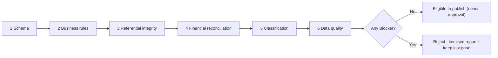

# 06 · Validation Framework

> **Law document.** Data integrity outranks every other goal (`01 §5.1`). No dataset reaches the Published store without passing every **Blocker** rule here. On failure, the last successfully validated version keeps serving.

---

## 1. Philosophy

The current workbook already validates itself — a three-way reconciliation, a vocabulary check, a transaction count, an explicit/contextual audit trail and a data-quality log. This framework **codifies that discipline in software and extends it**, so validation is automatic, repeatable and impossible to skip. Two hard commitments:

1. **The `TOTAL`-row trap never recurs.** The artifact that doubles ₹27.78 Cr → ₹55.56 Cr is caught by rule VR-11 and can never enter a published version.
2. **Bad data cannot go live.** A failed validation rejects the candidate and leaves the previously published version untouched and visible (§7).

## 2. The validation pipeline

Six sequential layers. A **Blocker** at any layer stops the publish; **Warnings** and **Info** are recorded and surfaced but do not stop it.

## 3. Severity model

| Severity | Meaning | Effect |
|---|---|---|
| **Blocker** | Integrity/correctness violation | Publish is refused |
| **Warning** | Suspicious but not disqualifying | Publishes; flagged in report + Data Quality |
| **Info** | Observation for correction at source | Logged; no gate |

## 4. Rule catalogue

Rule IDs (`VR-nn`) are stable references. "Baseline" states the current dataset's result, reproducing the workbook's own controls.

### Layer 1 — Schema
| ID | Rule | Severity | Baseline |
|---|---|---|---|
| VR-01 | All 13 RC tabs present and readable | Blocker | Pass |
| VR-02 | Required columns present on every tab (S.No, Payment Date, Voucher, Sanction, Head, Subvertical, Regional Centre, Grantee, Type, Narration, Net, General, SC, ST, Utilisation, Balance, Sub-Category) | Blocker | Pass |
| VR-03 | Header harmonisation resolves cleanly, incl. Guwahati `NER-General/NER-SC/NER-ST` → `General/SC/ST` | Blocker | Pass (1 header variance normalised) |
| VR-04 | Data types valid — dates are dates, amounts are numeric, no text in numeric fields | Blocker | Pass |

### Layer 2 — Business rules
| ID | Rule | Severity | Baseline |
|---|---|---|---|
| VR-05 | `net_amount = utilisation + balance_remaining` (per row) | Blocker | Pass |
| VR-06 | `amt_general + amt_sc + amt_st = net_amount` (community split reconciles) | Blocker | Pass |
| VR-07 | No negative amounts; `utilisation ≤ net_amount` | Blocker | Pass |
| VR-08 | `utilisation_pct` within [0,1] | Blocker | Pass |
| VR-09 | Payment dates within the reporting period / a plausible FY window | Warning | Pass (13–19 May 2026) |

### Layer 3 — Referential integrity
| ID | Rule | Severity | Baseline |
|---|---|---|---|
| VR-10 | Every Head, Subvertical, RC, Grantee resolves to a known dimension member | Blocker | Pass |
| VR-11 | **Artifact rows excluded** — `TOTAL`/subtotal/blank rows are not loaded as transactions | Blocker | 1 `TOTAL` row excluded → 88 loaded |
| VR-12 | Transaction count matches expected (loaded rows = sum of RC-tab data rows) | Blocker | 88 = 88 |

### Layer 4 — Financial reconciliation
| ID | Rule | Severity | Baseline |
|---|---|---|---|
| VR-13 | **Three-way tie-out**: Σ net (MASTER) = Σ net (13 RC tabs) = Σ net (SUB CATEGORY MASTER) | Blocker | ₹27,77,81,215 all three |
| VR-14 | Reconciliation difference across all three = **₹0** | Blocker | ₹0 (Pass) |
| VR-15 | Published totals equal the validated candidate's totals (no drift into the store) | Blocker | enforced |
| VR-16 | Utilisation and balance totals reconcile to net (₹4.71 Cr + ₹23.07 Cr = ₹27.78 Cr) | Blocker | Pass |

### Layer 5 — Classification
| ID | Rule | Severity | Baseline |
|---|---|---|---|
| VR-17 | No blank sub-category | Blocker | 0 blank (Pass) |
| VR-18 | Every sub-category ∈ the 40-term controlled vocabulary | Blocker | 0 outside vocabulary (Pass) |
| VR-19 | Each transaction carries a `classification_basis` (`explicit`/`contextual`) | Blocker | 84 explicit / 4 contextual |
| VR-20 | Contextual classifications are itemised for Finance confirmation | Warning | 4 flagged |

### Layer 6 — Data quality
| ID | Rule | Severity | Baseline |
|---|---|---|---|
| VR-21 | Duplicate detection (`sanction_no + grantee + net_amount`; repeated `voucher_no`) | Warning | screened |
| VR-22 | Narration/grantee consistency (narration names a *different* RC than the record) | Info | 1 (Trivandrum r15) |
| VR-23 | Purpose-not-stated (narration omits expense head; classified by context) | Info | 4 |
| VR-24 | Typographic anomalies flagged, **source text never altered** | Info | 6 (e.g. "206"→2026, "ODIDHA"→ODISHA) |
| VR-25 | Header/format inconsistency across tabs | Info | 1 (Guwahati NER-*) |
| VR-26 | Missing required narration/grantee/sanction where expected | Warning | monitor |

## 5. The reconciliation panel (surfaced in `04.13`)
The three-way tie-out is presented to the user, not hidden: three totals, their equality, the ₹0 difference, and a green/red state. It restates the workbook's Classification Audit as a live control, re-checked on every upload.

## 6. Duplicate & outlier logic
- **Duplicate:** exact match on `(sanction_no, grantee, net_amount)` or a `voucher_no` appearing twice within a version → Warning with both rows linked.
- **Outlier:** `net_amount > mean + 2σ` of the version, or above the configured large-release threshold → routed to the Exception Center (`05 §6`), not a validation block (a large legitimate release must still publish).

## 7. Failure behaviour — last good dataset  *(critical)*
- **VR-FAIL-01** If any Blocker fails, the candidate version is **rejected**; nothing is published.
- **VR-FAIL-02** The most recent successfully validated version continues to serve **every** screen, unchanged, with its original "as-of" stamp.
- **VR-FAIL-03** The uploader receives an **itemised, human-readable report**: rule id, layer, what failed, the offending rows/sheet, and how to fix it at source.
- **VR-FAIL-04** No partial publish. A version is all-or-nothing; there is never a half-loaded store.
- **AC:** injecting a broken workbook (e.g. a row where net ≠ utilised + balance) rejects the publish, shows VR-05 with the row reference, and leaves the live dashboard on the prior version.

## 8. Validation report UX
The report groups findings by severity: Blockers first (must fix), then Warnings (review), then Info (correct at source when convenient). It shows a pass/fail banner, the reconciliation panel, and a **diff vs current** (rows added/changed/removed, totals delta) so the checker approves with full sight of what will change. Info items flow into the Data Quality Log for correction at source — preserving the workbook's "record, don't alter" principle.

## 9. Re-validation on every change
Validation is not a one-time import step — it runs on **every** upload, every version, in every environment, with the identical rule set. Staging (UAT) exists precisely so a weekly workbook can be dry-run through the full catalogue before it touches Production.

---

*Next: read `07_Upload_System.md`.*
