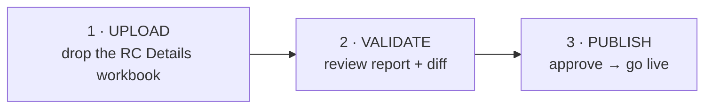
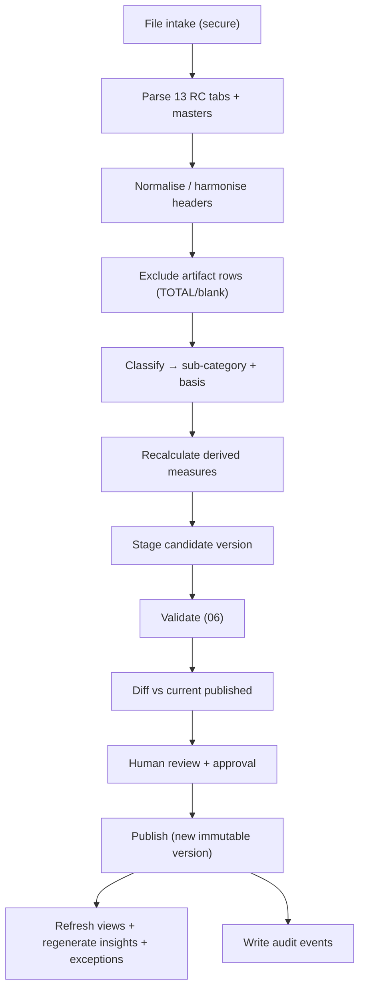

# 07 · Upload & Ingestion System

> **User-facing promise:** the user does three things — **Upload → Validate → Publish**. Everything else (parse, normalise, classify, recalculate, reconcile, version, refresh, generate insights, audit) happens automatically.

---

## 1. The three visible steps



No manual dashboard editing exists anywhere in the product. The dashboard is a **pure function of the latest published version**.

## 2. The automatic pipeline (behind the three steps)



## 3. Stage-by-stage

### 3.1 File intake
- Accept `.xlsx` (the RC Details workbook). Enforce size/type limits; scan/validate the file is a genuine workbook, not a renamed binary (`§8`).
- Store the raw file immutably in object storage as the version's evidence artifact, with a checksum.

### 3.2 Parse
- Read all 13 Regional-Centre tabs plus MASTER DATA, SUB CATEGORY MASTER, CLASSIFICATION AUDIT and DATA QUALITY LOG.
- Off the UI thread (edge/server function), using a robust multi-sheet parser (SheetJS).

### 3.3 Normalise / harmonise
- Trim, standardise casing, coerce types.
- **Header harmonisation** — map tab-specific headers to the canonical schema; the known case is Guwahati's `NER-General / NER-SC / NER-ST` → `General / SC / ST` (`03`, `06 VR-03`). New variants are surfaced, not silently guessed.

### 3.4 Exclude artifact rows  *(the TOTAL-row guard)*
- Rows that are totals/subtotals/blank (e.g. `S.NO. = "TOTAL"`, blank Head, a narration like "88 transactions") are **not** loaded as transactions (`06 VR-11`). This is the codified fix for the ₹27.78 Cr → ₹55.56 Cr doubling.

### 3.5 Classify
- Assign each transaction a sub-category from the controlled vocabulary using a deterministic rule engine:
  1. **Explicit** — expenditure purpose stated verbatim in the narration (e.g. "PROCUREMENT OF NON-CONSUMABLE SPORTS EQUIPMENT" → Sports Equipment). 84/88 baseline.
  2. **Contextual** — narration omits the head; derive from scheme structure + grantee + sanction line (e.g. a KIC advance with no head → Coach Salary (PCA)). 4/88 baseline; each recorded with basis = `contextual` and logged for Finance confirmation.
- The engine **never invents** a category and never edits narration; ambiguity becomes a Data Quality Log entry (`06 §L6`).

### 3.6 Recalculate
- Derive `utilisation_pct`, balances, community percentages, group roll-ups and all aggregate materialisations (`02 §6`).

### 3.7 Stage
- Persist as a **candidate version** (status = `staged`), fully isolated from the live Published store.

### 3.8 Validate → Diff → Review → Publish → Refresh
- Run the full rule catalogue (`06`). Produce the validation report and a **diff vs current** (rows added/changed/removed; totals delta).
- A checker reviews and approves (`§4`). On publish, the candidate becomes the new current version; views, insights and exceptions regenerate (< 30 s, NFR-5); audit events are written.

## 4. Approval workflow (maker-checker)
Government finance requires separation of duties.

```mermaid
sequenceDiagram
  actor Maker as Finance Officer (maker)
  actor Checker as Senior Finance / JS (checker)
  Maker->>System: Upload + run validation
  System-->>Maker: Report (blockers must be clear) + diff
  Maker->>Checker: Submit candidate for approval
  Checker-->>System: Review report + diff
  alt Approve
    Checker->>System: Publish
    System-->>All: New version live; notify
  else Reject
    Checker-->>Maker: Return with comments; last good stays live
  end
```

- A maker cannot publish their own upload; a checker must approve.
- Publishing is impossible while any Blocker is unresolved (`06`).

## 5. Versioning
- Every publish creates an immutable `dim_version` (`03 §9`): id, uploaded_by, published_by, timestamps, source-file reference + checksum, validation summary, diff summary.
- Versions are never mutated or deleted. Corrections are always a **new** version.
- The UI always shows "Data as of version N · published <date>".

## 6. Rollback
- A checker can roll back "current" to any prior published version in one action (`04.14`).
- Rollback is itself an audited event and re-points serving to the earlier immutable snapshot; nothing is destroyed and the rolled-past version remains in history.
- **AC:** after a bad-but-passed publish is discovered, rollback restores the previous version's exact figures and stamps within NFR-5.

## 7. Audit trail (immutable)
Every state-changing action is recorded append-only: uploads, validation runs (with outcome), submissions, approvals, publishes, rollbacks, taxonomy changes, threshold changes, logins and data exports. Each event carries actor, role, timestamp, version and a summary. The audit store is write-once (no update/delete), satisfying NFR-8 and the Auditor's needs (`01 §4`).

## 8. Security & RBAC
### 8.1 Role matrix
| Capability | Minister / Secretary / JS | Director | Finance Officer (maker) | Senior Finance (checker) | Analyst | Auditor |
|---|:--:|:--:|:--:|:--:|:--:|:--:|
| View dashboards & analytics | ✓ | ✓ | ✓ | ✓ | ✓ | ✓ |
| Universal search / explore | ✓ | ✓ | ✓ | ✓ | ✓ | ✓ |
| Export data / summaries | ✓ | ✓ | ✓ | ✓ | ✓ | ✓ |
| Upload + run validation | – | – | ✓ | ✓ | – | – |
| Approve / publish | – | – | – | ✓ | – | – |
| Rollback | – | – | – | ✓ | – | – |
| Manage taxonomy / thresholds | – | – | – | ✓ (config) | – | – |
| Manage users / roles | Admin only | | | | | |
| View audit trail | ✓ | ✓ | ✓ | ✓ | ✓ | ✓ (full) |

- Enforced at the **data layer** (Postgres RLS), not merely hidden in the UI (NFR-9).
- Least privilege by default; elevation is explicit and audited.

### 8.2 File & data security
- Validate file type/magic bytes and size before parsing; parse in an isolated function; never execute workbook macros.
- Encrypt in transit and at rest; source workbooks retained as immutable version evidence.
- No unauthorised data exposure across roles; every read is version- and role-scoped.

## 9. Idempotency & resilience
- Re-uploading an identical file (same checksum) is detected and does not create a duplicate version.
- A pipeline failure mid-way leaves no partial state — staging is transactional; only a fully validated, approved candidate is ever promoted.
- Concurrency: if two uploads race, they stage independently; only one can be the approved current version, and the audit records the sequence.

---

*Next: read `08_User_Flows.md`.*
