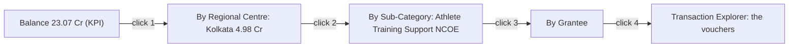

# 08 · User Flows

> Each flow names its **trigger, actor, steps, screens and success outcome**, and maps to a success criterion from `01 §7`. Click-paths are counted to prove SC-3 (≤ 4 clicks to a transaction).

---

## Flow A — The 30-second position check  *(SC-2)*
**Actor:** Joint Secretary · **Trigger:** opens the platform Monday morning.

1. Lands on **Executive Command Center**.
2. Reads the four tiles — ₹27.78 Cr sanctioned · 17% utilised · ₹23.07 Cr balance · Health Score — plus the top insight card: *"61 releases (₹19.58 Cr) show zero utilisation."*
3. Understands the position and the headline risk without a single click.

**Success:** correct mental model of SAI's finances in under 30 seconds. **Screens:** Command Center only.

---

## Flow B — Trace a KPI to the vouchers  *(SC-3, the four-click guarantee)*
**Actor:** Joint Secretary / Analyst · **Trigger:** "why is the balance so high?"



**Steps:** click the Balance KPI → drills to *By Regional Centre*; click Kolkata → *By Sub-Category*; click the NCOE line → *By Grantee*; click the grantee → **Transaction Explorer**, showing each voucher with sanction number, date, narration and amounts. The breadcrumb reads *Home ▸ Balance ▸ Kolkata ▸ NCOE ▸ Grantee* and every crumb is clickable.

**Success:** any headline number reaches its underlying transactions in **four clicks or fewer**. **Screens:** Command Center → drill pages → Transaction Explorer.

---

## Flow C — Weekly upload, validate, publish  *(SC-4)*
**Actors:** Finance Officer (maker), Senior Finance (checker) · **Trigger:** the new weekly RC Details workbook is ready.

```mermaid
sequenceDiagram
  actor M as Finance Officer
  participant S as Platform
  actor C as Checker
  M->>S: Upload workbook (Data Upload Center)
  S->>S: Parse, normalise, drop TOTAL row, classify, stage
  S->>S: Validate (06) + build diff vs current
  S-->>M: Report — blockers clear? + diff
  alt Blockers present
    S-->>M: Reject; last-good stays live; fix at source
  else Clean
    M->>C: Submit for approval
    C->>S: Review report + diff, Publish
    S-->>All: New version live; insights + exceptions refresh; notify
  end
```

**Success:** the dashboard updates from the validated upload with **zero manual dashboard editing**; a failed file never goes live (last-good served). **Screens:** Data Upload Center, validation report, Version History.

---

## Flow D — Investigate an exception  *(SC-1, intelligence comes to the user)*
**Actor:** Joint Secretary / Auditor · **Trigger:** notification "new high-severity exceptions".

1. Opens **Exception Center**; the **Idle Balance** queue lists 61 releases (₹19.58 Cr).
2. Sorts by amount; the largest is the ₹2.20 Cr Athlete Training Support–NCOE release.
3. Clicks it → **Transaction Explorer** row with sanction (KITD/12), date, narration and the holding centre.
4. Opens provenance (source sheet + row) for the audit reference; exports the queue for follow-up with the centres.

**Success:** from alert to specific voucher and its evidence in three clicks, with an exportable action list. **Screens:** Exception Center → Transaction Explorer.

---

## Flow E — Compare two Regional Centres  *(Director)*
**Actor:** Director · **Trigger:** "how does Kolkata compare to Trivandrum?"

1. Opens **Regional Centre Dashboard**, enables **Comparison mode**.
2. Selects Kolkata (₹4.98 Cr, 13 releases) and Trivandrum (₹3.04 Cr, 14 releases).
3. Sees them side by side — net, utilisation%, balance, idle count, sub-category mix.
4. Drills either column into its transactions.

**Success:** a like-for-like comparison with a clear read on which centre is moving funds. **Screens:** Regional Centre Dashboard (comparison).

---

## Flow F — Universal search to a transaction
**Actor:** any user · **Trigger:** knows a name or a sanction number.

1. Presses ⌘K (or clicks search), types "Gopichand" (or "KITD/12", or "Kolkata").
2. Results group by entity — grantee, sub-category, transaction, RC.
3. Selects a result; the platform navigates and filters to it, landing on the relevant page or the voucher.

**Success:** near-instant (< 300 ms) jump from a remembered term to the exact record. **Screens:** global search overlay → target page.

---

## Flow G — Approve rollback after a bad publish
**Actor:** Checker · **Trigger:** a published figure looks wrong.

1. Opens **Version History**; compares the current version's diff to the prior.
2. Confirms the regression; clicks **Rollback** to the previous version.
3. The dashboard reverts to the earlier version's exact figures and "as-of" stamp; the rollback is audited and users are notified.

**Success:** the live position is restored within NFR-5; nothing is destroyed; history and audit remain intact. **Screens:** Version History, audit trail.

---

## Flow H — Save and reopen an executive view
**Actor:** Joint Secretary · **Trigger:** wants the same weekly cut each Monday.

1. Sets filters (e.g. Recurring · TID · NER centres) on any analysis page.
2. **Save view** with a name; it captures the filter + drill state in the URL.
3. Next week, opens the saved view from **Home**; it reloads against the latest version's data.

**Success:** a repeatable, shareable executive cut with no re-filtering. **Screens:** any analysis page → Home (saved views).

---

## Flow-to-criterion coverage

| Flow | Primary criterion | Also proves |
|---|---|---|
| A · 30-second check | SC-2 | SC-1 |
| B · KPI → vouchers | SC-3 | SC-7 (traceable figures) |
| C · Upload/validate/publish | SC-4 | SC-7 (no bad data live) |
| D · Exception investigation | SC-1 | SC-3, SC-6 |
| E · Compare centres | SC-1 | SC-6 |
| F · Universal search | SC-1 | performance NFR-3 |
| G · Rollback | SC-7 | SC-4 |
| H · Saved view | SC-1 | SC-6 |

---

*Next: read `09_Design_System.md`.*
